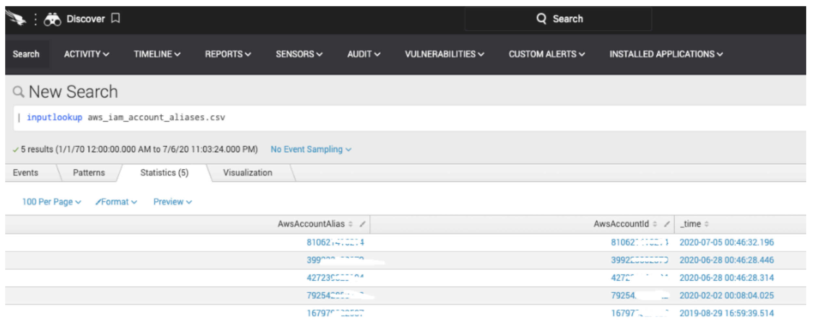
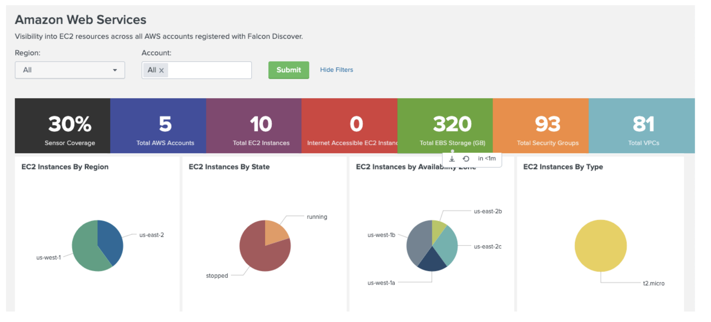

# Implementation Guide for CrowdStrike Falcon Discover for Cloud

# Foreward
With CrowdStrike Discover for Cloud and Conainers you can gain immediate and comprehensive visibility into all managed endpoints equipped with CrowdStrike Falcon workload security, and unmanaged assets across all accounts. In addition, Discover for Cloud and Containers is able to cross boundaries to see Amazon Virtual Private Cloud (Amazon VPC) and subnets, and collect data from all endpoints -- even those that are unmanaged -- as well as all hybrid infrastructure. The rich AWS content Discover for Cloud and Containers allows organizations to quickly understand and prioritize instances and immediately ensure that the Falcon sensor is fully deployed, dramatically improving organizations' security positions.

The purpose of this Implementation Guide is to enable every AWS Marketplace customer to seamlessly activate, deploy, and configure, CrowdStrike Discover for Cloud and Containers in an AWS Control Tower environment while taking full advantage of the resources pre-configured by AWS Control Tower as part of the initialization.

# Solution Overview and Features
## Benefits of CrowdStrike Discover for Cloud and Containers
CrowdStrike Discover for Cloud and Containers offers streamlined integration not available with other third-party solutions. This integration saves organizations the time and expense of trying to develop these capabilities in-house. Discover for Cloud and Containers offers the following benefits:

* **Identifies security gaps with comprehensive and consistent visibility across all Amazon Elastic Compute Cloud (Amazon EC2) instances and endpoints.** 
By uniquely combining information from Discover for Cloud and Containers and AWS metadata, security teams are able to baseline exisitng Amazon EC2 deployments instantly across all regions and subsequently monitor AWS CloudTrail logs for any modifications to the environment. This holistic asset management across entire data centers and AWS cloud resources allows you to identify unmanaged assets -- pinpointing security gaps and closing them.

* **Prioritizes detections for faster and more effective response.**
Discover for Cloud and Containers delivers rish AWS metadata on EC2 instances, so that unprotected assets and impacted systems are quickly prioritized. It provides the critical answers analysts need such as: Is this system internet accessible? Does it have AWS Identity and Access Management (IAM) roles applied with elevated privileges? Is it on the same Amazon VPC as critical assets? Armed with this context-rich information, organizations can apply proactive measures to dramatically improve their security posture.

* **Ensures consistent security across hybrid environments**.
As organizations move to the cloud, they are implementing hybrid data center with workloads running on-premises and in the cloud, which can impede a consisteny level of security. Discover for Cloud and Containers provides visibility across all assets whether they are on-premises or EC2 instances in AWS. In addition, the visibility extends to both managed and unmanaged assets -- allowing organizationsl to quickly ensure that all assets are being protected.

* **Conserves resources with easy deployment and integrated management.**
Often security teams find they must pivot across a variety of tools and workflows as they attempt to span physical, virtual, and cloud environments. Discover for Cloud and Containers is one tool that provides instant visibility and control over existing on-premise endpoints and EC2 isntances without requiring any additional agents, or installing scripts that can burden teams and slow performance. As a cloud-native security tool, Discover for Cloud and Containers deploys instantly and scales easily with no hit to performance and no requirement to reboot. It is powered by the Falcon sensor, a single lightweight agent, and managed via the unified Falcon console.

# Architecture Diagram
Falcon Discover for Cloud and Containers has read-only access to your EC2 metadata. This minimizes the security impact to your AWS infrastructure. It calls AWS APIs on your behalf using a cross account IAM role, and it also processes CloudTrail logs.

Falcon Discover for Cloud and Containers monitors CloudTrail logs stored in your log archive account Amazon Simple Storage Service (Amazon S3) bucket. When a new log file is written to the S3 bucket, an Amazon Simple Notification Service (Amazon SNS) notification is sent to the SNS topic hosted in a CrowdStrike account.

CrowdStrike will require the ability to assume an IAM role that allows the ``s3-GetObject`` permissions on the S3 bucket hosting your CloudTrail logs.

CrowdStrike will analyze the logs in the log file, if an event of interest is found it will make an API call to the account where the log was created and gather information about the resources that have been created.


1) The Customer creates a new AWS account using Account Factory within AWS Control Tower Master account.

2) Account Factory creates a new AWS account and applies baseline guardrails.

3) On completion of account creation a ``CreateManagedAccount`` event notification is generated. Reference the AWS documentation at [https://docs.aws.amazon.com/controltower/latest/userguide/lifecycle-events.html#createmanaged-account](https://docs.aws.amazon.com/controltower/latest/userguide/lifecycle-events.html#createmanaged-account).

4) The CloudWatch event rule triggers a Lambda function that will generate account specific parameters.

5) The custom parameters are passed to the StackSet that is applied to the new account.

6) The stack creates an additional IAM role and a Lambda custom resource. This role will allow CrowdStrike to assume a role with the following permissions:
    
    * *ec2:DescribeInstances*
    * *ec2:DescribeImages*
    * *ec2:DescribeNetworkInterfaces*
    * *ec2:DescribeVolumes*
    * *ec2:DescribeVpcs*
    * *ec2:DescribeRegions*
    * *ec2:DescribeSubnets*
    * *ec2:DescribeNetworkAcls*
    * *ec2:DescribeSecurityGroups*
    * *iam:ListAccountAliases*

    The custom Lambra resource will register the account with CrowdStrike Discover for Cloud using an API call. The role ```arn`` together with the details of the log archive S3 bucket are passed in an HTTP POST to CrowdStrike.

# Pre-requisites
Customers will require the following:
* Subscription to Falcon Discover for Cloud & Containers **or** the Falcon Cloud Workload Protection Bundle.
* Subscription to Falcon Insight

The following parameters will be stored in AWS Secrets Manager in the master account:
* Falcon Cloud API ClientID
* Falcon Cloud API Client Secret

CrowdStrike will pass an ``externalid`` when trying to assume a role in the log archive account to read the log files. We recommend that you become familiar with the following article:

How to Use an External ID When Granting Access to Your AWS Resources to a Third Party:
[https://docs.aws.amazon.com/IAM/latest/UserGuide/id_roles_create_for-user_externalid.html](https://docs.aws.amazon.com/IAM/latest/UserGuide/id_roles_create_for-user_externalid.html)

Note: the ``externalid`` is a string of random characters.

If you are new to AWS, see Getting Started with AWS:
[https://aws.amazon.com/getting-started/](https://aws.amazon.com/getting-started/)

For additional information on AWS Marketplace:
[https://aws.amazon.com/marketplace/help/about-us?ref_=footer_nav_about_aws_marketplace](https://aws.amazon.com/marketplace/help/about-us?ref_=footer_nav_about_aws_marketplace)

To get started with AWS Control Tower, review the User Guide:
[https://docs.aws.amazon.com/controltower/latest/userguide/getting-started-with-control-tower.html](https://docs.aws.amazon.com/controltower/latest/userguide/getting-started-with-control-tower.html)

# Deployment Configuration Steps

## Step 1: Subscribe to Falcon for AWS in the AWS Marketplace

1) Subscribe to Falcon for AWS (Annual + Consumption Billing) on AWS Marketplace.

    Locate the **AWS (Annual + Consumption Billing)** CrowdStrike product in the AWS Marketplace:

    [https://aws.amazon.com/marketplace/pp/B081QWWMB6?qid=1593190522787&sr=0-7&ref_=srh_res_product_title](https://aws.amazon.com/marketplace/pp/B081QWWMB6?qid=1593190522787&sr=0-7&ref_=srh_res_product_title)

    
 
    Once located, click on the **Continue to Subscribe** button.

2) Guidance on Contract Duration and Renewal

    Your contract can be configured in the new screen. Select the **Contract Duration** and set the **Renewal Settings** as appropriate for your organization.

    
 

3) Select Contract Options

    Select the Contract Options to be activated with your contract.

    

4) Create the contract and pay

    Once you have configured your contract, you can click on the Create contract button. You will be prompted to confirm the contract. If you agree to the pricing, select the **Pay Now** button.

## Step 2: Configuration: Solution to Deploy
Setup consists of the following high-level tasks:

* Load the CloudFormation template in the ``log-archive`` account.
* Load the CloudFormation template in the master account.

1) Generate CrowdStrike Falcon API Keys.

    First login to the CrowdStrike console and go to ``Support --> API Clients and Keys``. Obtain CrowdStrike OAuth2 keys from the Falcon Console. Copy the ``CLIENT ID`` and ``SECRET`` as these will be used in the template.

    

    
2) Download the code from [https://github.com/CrowdStrike/Cloud-AWS](https://github.com/CrowdStrike/Cloud-AWS).

    The GitHub repository contains the following folder structure:

    * *Control-Tower/log-archive-acct*: CloudFormation template for the ControlTower ``log-archive`` account

    * *Control-Tower/master-acct*: CloudFormation template for the Control Tower master account

3) Load the CloudFormation template in the ``log-archive`` account.

    Login to the ``log-archive`` account and apply the CloudFormation template "*ct_crowdstrike_log_archive_account.yaml*" from the ``log-archive-acct`` folder.

    The CloudFormation template will create a Role named ``FalconDiscover`` in the ``log-archive`` account that will permit read access to objects in the S3 bucket and discover resources in the account. The role is restrictured such taht only the IAM role "*arn:aws:iam:292230061137:role/CS-Prod-HG-CsCloudconnectaws*" can assume the role in the account to read the log files.

    

    The template will also create an S3 bucket event notification that will send an SNS notification to the CrowdStrike SNS topic "*arn:aws:sns:(region):292230061137:cs-cloudconnect-aws-cloudtrail*":

    

4) Load the CloudFormation template in the master account.

    Go to the master account and apply the CloudFormation template "*ct_crowdstrike_master_account.yaml*" from the ``master-acct`` folder.

    Description of Parameters:

    * **FalconClientId**: Your Falcon OAuth2 API Key from the CrowdStrike Console.

    * **FalconSecret**: Your Falcon OAuth2 API Secret from the CrowdStrike Console.

    * **ExternalID**: String of random characters. Reference [https://docs.aws.amazon.com/IAM/latest/UserGuide/id_roles_create_for-user_externalid.html](https://docs.aws.amazon.com/IAM/latest/UserGuide/id_roles_create_for-user_externalid.html).

    * **CSAccountNumber**: The number supplied in the template, ``292230061137``, should **NOT** be changed unless directed by CrowdStrike.

    * **LambdaBucketName**: Name of the S3 bucket that was created by the script to run in Step 3.4.

    * **RoleName**: This name may be modified as required.

    * **CSAssumingRoleName**: The name supplied in the template ``CS-Prod-HG-CSCloudconnectaws`` should **NOT** be changed unless directed by CrowdStrike.

    * **LogArchiveAccount**: AWS account number where the log archive bucket that was created by Control Tower.

    * **LogArchiveBucketName**: CloudTrail log archive bucket that was created by Control Tower.

    * **LogArchiveBucketRegion**: Region where CloudTrail log archive bucket that was created by Control Tower.

    The CloudFormation template will create the following resources in the account:

    * StackSet will be applied to new accounts.

    

    * CloudWatch rile to trigger a lambda function.

    

    * Lambda function triggered by CloudWatch to push the StackSet to a new account.

    

    * Lambda function to reguster the master account with CrowdStrike Falcon.

5) Verification Steps

    Create or Enroll an account in to AWS Control Tower using account factor:

    

    Once the account has been created (usually takes around 30 minutes), check the status of the account:

    

    Go to CloudFormation -> StackSets and verify the stack instance exists:

    

    Login to the new account and check that the StackSet has been applied.

    The StackSet will configure two resources:

        * IAM Role named ``FalconDiscover``
        * Lambda functon to register the account with Falcon Discover service

    Verify that the IAM role has been configured in the new account:

    

    Go to CloudWatch logs and verify that the lambda function created has run and successfully and registered the account:

    

6) Check the Discover accounts

    Login to the CrowdStrike console and check the account status. Navigate to ``Discover --> Amazon Web Services --> Accounts``. The screen below will show the accounts that have been added:

    

    Accounts and resources will begin to appear in the dashboard:

    

# Additional Resources
ID When Granting Access to Your AWS Resources to a Third Party:
* [https://docs.aws.amazon.com/IAM/latest/UserGuide/id_roles_create_for-user_externalid.html](https://docs.aws.amazon.com/IAM/latest/UserGuide/id_roles_create_for-user_externalid.html)

If you are new to AWS, see Getting Started with AWS:
* [https://aws.amazon.com/getting-started/](https://aws.amazon.com/getting-started/)

For additional information on AWS Marketplace:
* [https://aws.amazon.com/marketplace/help/about-us?ref_=footer_nav_about_aws_marketplace](https://aws.amazon.com/marketplace/help/about-us?ref_=footer_nav_about_aws_marketplace)

To get started with AWS Control Tower:
* [https://docs.aws.amazon.com/controltower/latest/userguide/getting-started-with-control-tower.html](https://docs.aws.amazon.com/controltower/latest/userguide/getting-started-with-control-tower.html)

# CrowdStrike Resources
To learn more about CrowdStrike:
* [CrowdStrike on Amazon Partner Network (APN)](https://aws.amazon.com/partners/find/partnerdetails/?n=CrowdStrike&id=001E000001VAPbPIAX)
* [CrowdStrike website](http://crowdstrike.com/)

To review CrowdStrike AWS Marketplace Listings:
* [CrowdStrike AWS Marketplace Listings](https://aws.amazon.com/marketplace/seller-profile?id=f4fb055a-5333-4b6e-8d8b-a4143ad7f6c7)

To learn more about Falcon Cloud Workload Protection product:
* [CrowdStrike Falcon Cloud Workload Protection Website](https://www.crowdstrike.com/cloud-security-products/falcon-cloud-workload-protection/)
* [CrowdStrike Falcon Cloud Workload Protection Data sheet](https://www.crowdstrike.com/resources/data-sheets/falcon-cloud-workload-protection/)

# CrowdStrike Contact Information
For questions regarding CrowdStrike offerings on AWS Marketplace or service integrations: [aws@crowdstrike.com](aws@crowdstrike.com)

For questions around product sales: [sales@crowdstrike.com](sales@crowdstrike.com)

For questions around support: [support@crowdstrike.com](support@crowdstrike.com)

For additional information and contact details: [https://www.crowdstrike.com/contact-us/](https://www.crowdstrike.com/contact-us/)